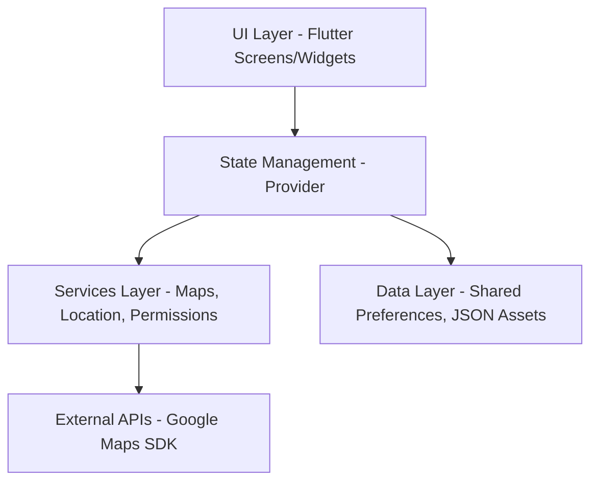

# SafeCity - Interview Preparation Guide

This guide provides a simplified explanation of the **SafeCity** project, its architecture, and its working mechanism to help you explain it confidently in an interview.

---

## 1. Project Overview (The "Elevator Pitch")
**SafeCity** is a Flutter-based mobile application designed to enhance personal safety in urban environments. It acts as a digital safety companion that provides real-time location tracking, emergency assistance (SOS), and community-driven security features.

*   **Problem it Solves**: Lack of immediate assistance during physical or digital (cyber) emergencies and the need for situational awareness (secure vs. risky zones).
*   **Target Audience**: Students, professionals, and anyone navigating unfamiliar or high-risk areas.

---

## 2. System Architecture (The "How it's Built")
The project follows a **Clean Architecture** approach using Flutter, ensuring the UI is decoupled from the data logic.

### **Frontend (Mobile App)**
*   **Framework**: **Flutter (Dart)** – Chosen for its cross-platform capability (Android & iOS) and high-performance UI rendering.
*   **State Management**: **Provider** – Used to manage app state globally (e.g., user profiles, theme settings, state-wise safety data) and ensure the UI stays in sync with data changes.
*   **Mapping & GIS**: **Google Maps Flutter** – Integrated for real-time visualization of safe zones and user location.

### **Data & Persistence**
*   **Local Storage**: **Shared Preferences** – Used for persisting user profiles, emergency contacts, and app preferences locally on the device.
*   **Services Layer**: Custom services for handling **Geolocator** (GPS tracking) and **Permissions** (Location, Phone access).

### **Architecture Diagram (Mental Model)**

---

## 3. Core Working & Features (The "How it Works")

### **A. User Onboarding & Profile**
When a user first opens the app, they set up their profile and add **Emergency Contacts**. This data is stored securely using `Shared Preferences`.

### **B. Real-Time Safety Monitoring**
The app calculates a **Safety Score** based on the user's current location and historical safety data of that area.
*   **Safe Zones**: Areas with high patrol/community activity.
*   **Caution/High Risk**: Based on state-wise safety statistics provided in the "Indian States Explorer."

### **C. 3-Layer Protection System**
1.  **Surveillance Layer**: Uses Google Maps to monitor safe zones and provide navigation through well-lit or active areas.
2.  **Community Layer**: A "Community Hub" where users can request volunteer patrols or report incidents.
3.  **Technology Layer**: Automates SOS triggers.

### **D. Emergency Response (SOS)**
This is the heart of the project. There are two types of SOS:
*   **Physical SOS**: For immediate physical danger. It triggers location sharing with emergency contacts and authorities.
*   **Cyber SOS**: A unique feature for digital safety and cyberbullying reporting.

---

## 4. Key Technical Decisions (Interview "Deep Dive")
*   **Why Flutter?** I wanted a consistent experience across platforms without writing separate code for Android and iOS.
*   **Why Google Maps?** It provides the most reliable and feature-rich GIS infrastructure for location-based safety apps.
*   **Why Provider?** It’s lightweight and handles the requirements of a safety app (where performance is critical) better than more complex alternatives for this scale.

---

## 5. Potential Interview Questions & Answers

**Q: How do you ensure user location is shared even if the app is in the background?**
*   **A**: I use the `geolocator` package which supports background location updates. For production, we would implement a background service to ensure the SOS signal remains active even if the screen is locked.

**Q: How is the state-wise safety data updated?**
*   **A**: Currently, it is stored in a structured JSON format within the app. In a production environment, this would be fetched from a REST API (using the `http` package) connected to a government or community-driven database.

**Q: How do you protect user data?**
*   **A**: Personal info and contacts are stored locally using encrypted storage where possible. For the prototype, `Shared Preferences` is used, but for production, we’d migrate to `Flutter Secure Storage`.

---

## 6. Future Enhancements
*   **Backend Integration**: Migrating from local storage to a cloud database like **Firebase** or a custom **Node.js/SQL** backend for real-time community alerts.
*   **Push Notifications**: Using FCM (Firebase Cloud Messaging) for instant emergency alerts.
*   **AI Integration**: Using machine learning to predict "High Risk" zones based on time of day and historical crime data.
